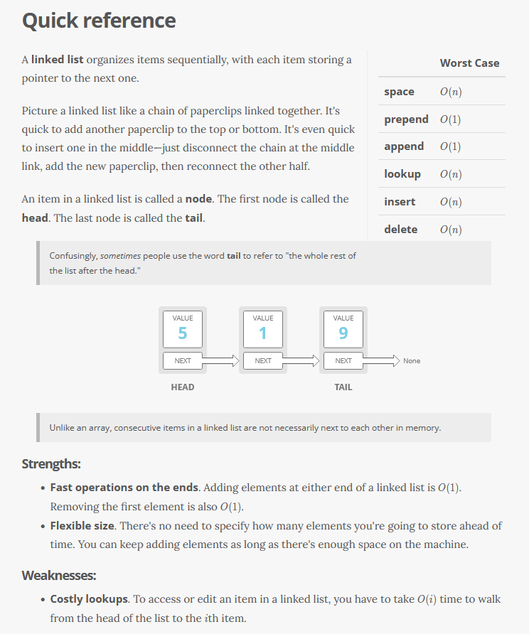
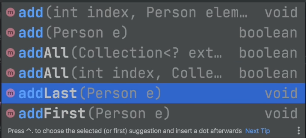

# Linked List
-----------------




(Depicted Doubly Linked List because you have a reference to next and previous)

-  Expensive on memory (Need to know reference to next and previous, so takes up extra memory)
-  Made up of multiple nodes
    - Head Node - previous points to null
    - Tail Node - next points to null
    - Each Node contains reference to next node and reference to previous node
- LinkedLists are implementations of the Queue interface

```
LinkedList<Person> linkedList = new LinkedList<>();

linkedList.add(new Person("Alex", 21));
System.out.println(linkedList);
//returns:
//Person[name=Alex, age=21]

linkedList.add(new Person("Will", 25));
System.out.println(linkedList);

//returns:
//Person[name=Alex, age=21]
//Person[name=Will, age=25]

//Use a list iterator to loop through a list
ListIterator<Person> personListIterator = linkedList.listIterator();

//Loop forwards through list
while(personListIterator.hasNext())
{
  System.out.println(personListIterator.next());
}
//returns:
//Person[name=Alex, age=21]
//Person[name=Will, age=25]

//Loop backwards through list
while(personListIterator.hasPrevious())
{
  System.out.println(personListIterator.previous());
}
//returns:
//Person[name=Will, age=25]
//Person[name=Alex, age=21]
```

----------

### Remove from linked list

```
linkedList.remove("insertItemHere");
```

----------

Add implementations/parameters:




-----------
### InterviewCake - Deleting a Node

```
  public class LinkedListNode {

    public int value;
    public LinkedListNode next;

    public LinkedListNode(int value) {
        this.value = value;
    }
}

LinkedListNode a = new LinkedListNode(1);
LinkedListNode b = new LinkedListNode(2);
LinkedListNode c = new LinkedListNode(3);

a.next = b;
b.next = c;

deleteNode(b);

```

```
public static void deleteNode(LinkedListNode nodeToDelete) {

    // get the input node's next node, the one we want to skip to
    LinkedListNode nextNode = nodeToDelete.next;

    if (nextNode != null) {

        // replace the input node's value and pointer with the next
        // node's value and pointer. the previous node now effectively
        // skips over the input node
        nodeToDelete.value = nextNode.value;
        nodeToDelete.next  = nextNode.next;

    } else {

        // eep, we're trying to delete the last node!
        throw new IllegalArgumentException("Can't delete the last node with this technique!");
    }
}
```

### Reverse a Linked List
-  O(n) time and O(1) space. We pass over the list only once, and maintain a constant number of variables in memory. 
-  In-place method - meaning modifying the list itself so changes last after the method is done.

```
public static LinkedListNode reverse(LinkedListNode headOfList) {
    LinkedListNode currentNode = headOfList;
    LinkedListNode previousNode = null;
    LinkedListNode nextNode = null;

    // until we have 'fallen off' the end of the list
    while (currentNode != null) {

        // copy a pointer to the next element
        // before we overwrite currentNode.next
        nextNode = currentNode.next;

        // reverse the 'next' pointer
        currentNode.next = previousNode;

        // step forward in the list
        previousNode = currentNode;
        currentNode = nextNode;
    }

    return previousNode;
}
```
