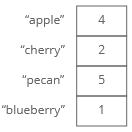
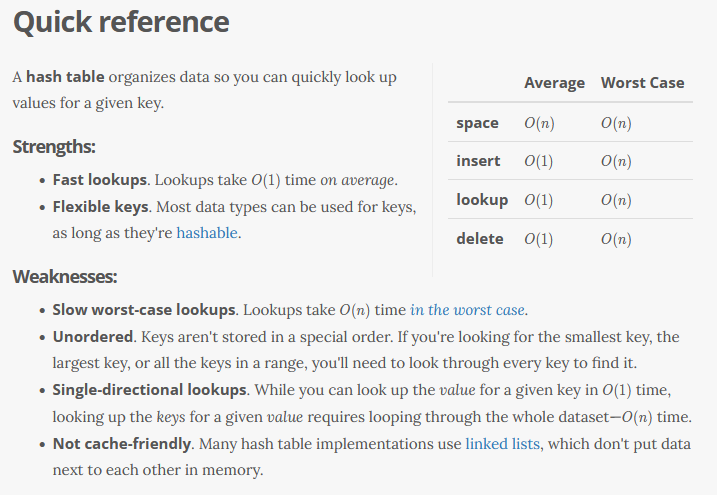
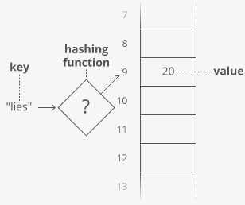
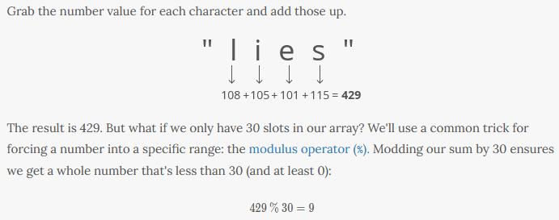
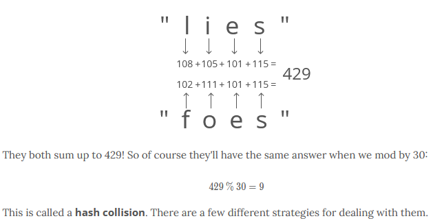
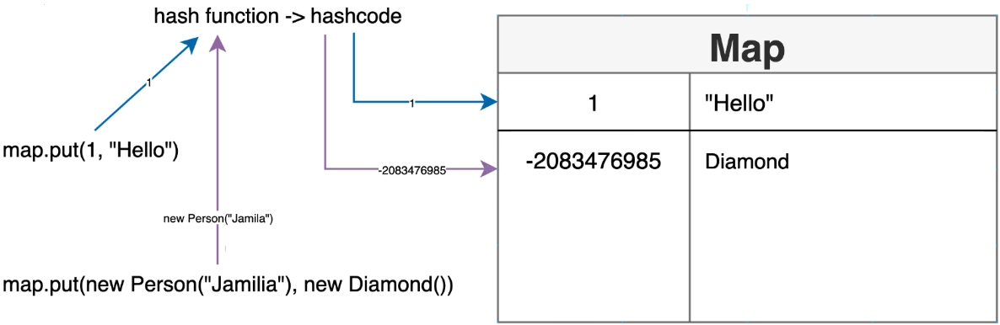

# Maps / Hash Table



Other names:
-  hash, 
-  hash map, 
-  map, 
-  unordered map, 
-  dictionary 

Java has two hash table classes: *HashTable* and *HashMap*. In general you should use a HashMap

>  While both classes use keys to look up values, there are some important differences, including:
>  
>    -  A HashTable doesn't allow null keys or values; a HashMap does.
>    -  A HashTable is synchronized to prevent multiple threads from accessing it at once; a HashMap isn't.


------------


-  A collection of (key, value) pairs
-  A map connot contain duplicate keys
-  Each key can map to at most one value


-------------

Map implementations that Java offers


#### General-purpose map implentations:
-  HashMap
    -  If you want maximum speed and don't care about iteration order
-  TreeMap
    -  If you need SortedMap operations or key-ordered Collection-view iteration
-  LinkedHashMap 
    -  If you want near-HashMap perormance and insertion-order iteration
#### Special-Purpose Map Implementations:
-  EnumMap
        -  high-performance Map implementation for use with enum keys (internally implemented as an array)
-  WeakHashMap
        -  implementation that stores only weak references to its keys (allows a key-value pair to be garbage-collected when its key is no longer referenced outside of the WeakHashMap)
-  IdentityHashMap
        -  Identity-based Map implementation based on a hash table (useful for topology-preserving object graph trasnformations, such as serialization or deep-copying
#### Concurrent Map Implentations:
-  ConcurrentMap
   -  A highly concurrent, high-performance implmentation backed up by a hash table (intended as a drop-in replacement for Hastable; also supports all the legacy methods peculiar to Hashtable)

-------------
#### Code Examples

Creating a map & Adding elements:

```
Map<Integer, Person> map = new HashMap<>();

// if there is a key duplicate it will overwrite the first

map.put(1, new Person("Alex"));
map.put(2, new Person("Alexa"));
map.put(3, new Person("Alexander"));
```

Prints outs:

```
System.out.println(map);  // returns:  {1=Person[name=Alex], 2=Person[name=Alexa], 3=Person[name=Alexander]}


System.out.println(map.size());  // returns:  3


System.out.println(map.get(1));  // returns:  Person[name=Alex]


System.out.println(map.containsKey(4));  // returns:  false


System.out.println(map.entrySet());  // returns:  1, 2, 3


System.out.println(map.keySet());  // returns:  {1=Person[name=Alex], 2=Person[name=Alexa], 3=Person[name=Alexander]}

System.out.println(map.values());  // returns:  [Person[name=Alex', Person[name=Alexa], Person[name=Alexander]]
```

Loop through:

```
//loop through map

map.entrySet().forEach(System.out::println);

//returns:
//1=Person[name=Alex]
//2=Person[name=Alexa]
//3=Person[name=Alexander]

---------------------------------------------------------------------------------

//loop through, return key and value

map.entrySet().forEach(x -> System.out.println(x.getKey() + " " + x.getValue()));

//returns:
//1 Person[name=Alex]
//2 Person[name=Alexa]
//3 Person[name=Alexander]

---------------------------------------------------------------------------------

//another for each loop

map.forEach((key, person) -> {
    System.out.println(key + " - " + person);
});
```

Remove a key / getOrDefault

```
//to remove a key

map.remove(3);

----------------------------------------------------------------------------------

System.out.println(map.get(3));  // returns null

System.out.println(map.getOrDefault(3, new Person("default")));

System.out.println(map.values());  //returns:  [Person[name=Alex', Person[name=Alexa], Person[name=default]]
```

--------------------------------------------------
# Hash 101

A **hash method** takes data (like a string, or a file’s contents) and outputs a hash, a fixed-size string or number. 

i.e.
>  DF7CE038E2FA96EDF39206F898DF134D

-  hash can be thought of as a "fingerprint."
    -  We can trust that a given file will always have the same hash, but we can't go from the hash back to the original file

#### Some uses for hashing

1)  **Hash Maps**
    -  Basic idea: we want an array-like data structure with constant-time lookups, but we want to look up values based on arbitrary "keys," not just sequential "indices."
        -  We could allocate an array, and use a hash method to translate keys into array indices
2)  **Preventing man-in-the-middle attacks*
    -  Compare website's downloaded file hash with your own
        -  If it doesn't match, your internet service provider or someone else might have injected malware or tracking software into your download  

**Hash Maps are built on arrays**

All we need is a function to convert a key into an array index (an integer). That function is called a hashing function. 



To look up the value for a given key, we just run the key through our hashing function to get the index to go to in our underlying array to grab the value. 

**How do hashing methods work? (Simple proof of concept)



>  The hashing methods used in modern systems get pretty complicated—the one we used here is a simplified example.

**Hash Collisions**
-  When two keys hash to the same index in the array



**How to deal with Hash Collisions**

instead of storing the actual values in our array, let's have each array slot hold a pointer to a linked list holding the values for all the keys that hash to that index

### When hash table operations cost O(n) time

**Hash Collisions**
-  Absolute worst case (*Unlikely, but could*)
    -  If *all* our keys caused hash collisions, we'd be at risk of having to walk through all of our values for a single lookup
**Dynamic array resizing**
To mitigate hash collisions as the hash map gets larger
-  we could expand our underlying array
    -  This requires allocating a larger array and rehashing all of the existing keys to figure out their new position—*O(n) time*. 

------------------------------------------------

Hashfunctions & Hashcode


