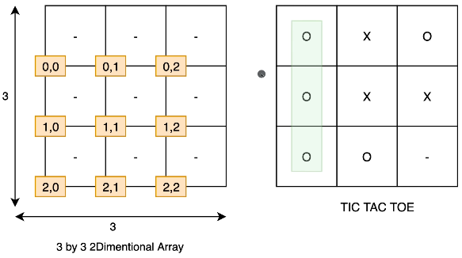

### 2D Array

-  Whenever you want a grid, use 2D Arrays

--------------



Example: tic-tac-toe game

```
char[][] board = new char[3][3];

for (int i = 0; i < 3; i++)
{
  for (int j = 0; j < 3; j++)
  {
    board[i][j] = '-';
  }
}

System.out.println(Arrays.deepToString(board));
```
Because it's a 2D Array we use deepToString instead of toString

returns:

[[-, -, -], [-, -, -], [-, -, -]]

```
board[0][0] = '0';
board[1][0] = '0';
board[2][0] = '0';

System.out.println(Arrays.deepToString(board));
```

returns:

[[0, -, -], [0, -, -], [0, -, -]]


##### Creating an inline array
```
char[][] boardTwo = new char[][]{
  new char[] {'0', '-', '-'},
  new char[] {'0', '-', '-'},
  new char[] {'0', '-', '-'}
};

System.out.println(Arrays.deepToString(boardTwo));
```


returns:

[[0, -, -], [0, -, -], [0, -, -]]
