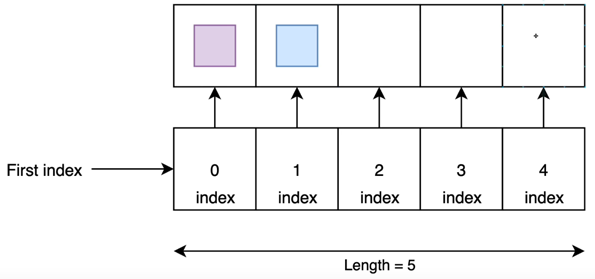

# Arrays 101
------------

Time Complexitity:
O(N)

-  Fixed size
-  Fast for data retrieval
-  Compact memory usage (if size is known)
-  Delete operation very hard



------------
Arrays come from this package:
```
import java.util.Arrays;
```

```
String[] colors = new String[5];

colors[0] = "purple";
colors[1] = "blue";

System.out.println(Arrays.toString(colors));
System.out.println(colors[4]);
```
returns:

[purple, blue, null, null, null]

```
System.out.println(colors[0]);
System.out.println(colors[1]);
System.out.println(colors[2]);
System.out.println(colors[3]);
System.out.println(colors[4]);
```
returns:

purple

blue

null

null

null

```
colors[2] = "yellow";
System.out.println(Arrays.toString(colors));
```
returns: 

[purple, blue, yellow, null, null]

------------

If you know the size of your array and the elements in them, you can define it this way:
(once you define the array you cannot change it's size)
```
int[] numbers = {100, 200};
```

looping through arrays:

for loop -
```
for (int i = 0; i < colors.length; i++) 
{
System.out.println(colors[i];
}
```

reverse for loop -
```
for (int i = colors.length - 1; i >= 0; i--) 
{
System.out.println(colors[i]);
}
```
(colors.length = size of array (not index), because of this we must do colors.length - 1)

Enhanced for loop -

```
for (String color : colors)
{
System.out.println(color);
}
```

Using stream -
```
Arrays.stream(colors).forEach(System.out::println)
```

Arrays utilize the Arrays Utility Class
Has many utility methods
```
Arrays.____
```
