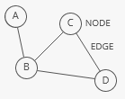
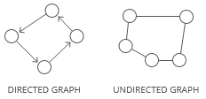
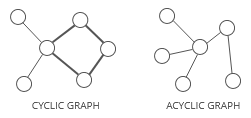
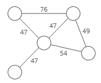
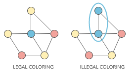
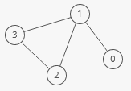

# Graph
-----------

A **graph** organizes items in an interconnected network

Each item is a **node**(or **vertex**). Nodes are connected by **edges**



**Strengths:**
-  **Representing links**. Graphs are ideal for cases where you're working with *things that connect to other things*. Nodes and edges could, for example, respectively represent cities and highways, routers and ethernet cables, or Facebook users and their friendships.

**Weaknesses:**
-  **Scaling challenges**. Most graph algorithims are O(n\*\lg(n)) or even slower. Depending on the size of your graph, running algorithms across your nodes may not be feasible.

--------------------------------

## Terminology:

### Directed or undirected

In **directed** graphs, edges point from the node at one end to the node at the other end. In **undirected** graphs, the edge simply connect the nodes at each end.



### Cyclic or acyclic

A graph is ** cyclic** if it has a cycle - an unbroken series of nodes with no repeating nodes or edges that connects back to itself. Graphs without cycles are **acyclic**.



### Weighted or unweighted

If a graph is **weighted**, each edge has a "weight." The weight could, for example, represent the distances between two locations, or the cost or time it takes to travel between the locations.



### Legal coloring

A **graph coloring** is when you assign colors to each node in a graph. A **legal coloring** means no adjacent nodes have the same color.



----------------------

## Representations

There are a few different ways to store graphs. Let's take this graph as an example:



### Edge list

- A list of all edges in the graph:

```
int[][] graph = {{0, 1}, {1, 2}, {1, 3}, {2, 3}};
```

Since node 3 has edges to nodes 1 and 2, {1, 3} and {2, 3} are in the edge list. 

> Sometimes it's helpful to pair our edge list with a list of all the nodes. For example, what if a node doesn't have any edges connected to it? It wouldn't show up in our edge list at all! 

### Adjacency list

- A list where the index represents the node and the value at that index is a list of the node's neighbors: 

```
int[][] graph = {
    {1},
    {0, 2, 3},
    {1, 3},
    {1, 2}
};
```

Since node 3 has edges to nodes 1 and 2, graph[3] has the adjacency list {1, 2}. 

We could also use a hash map where the keys represent the node and the values are the lists of neighbors. 

```
Map<Integer, List<Integer>> graph = new HashMap<>() {
    {
        put(0, Arrays.asList(1));
        put(1, Arrays.asList(0, 2, 3));
        put(2, Arrays.asList(1, 3));
        put(3, Arrays.asList(1, 2));
    }
};
```

This would be useful if the nodes were represented by strings, objects, or otherwise didn't map cleanly to array indices. 

### Adjacency matrix

- A matrix of 0s and 1s indicating whether node x connects to node y (0 means no, 1 means yes). 

```
int[][] graph = {
    {0, 1, 0, 0},
    {1, 0, 1, 1},
    {0, 1, 0, 1},
    {0, 1, 1, 0},
};
```

Since node 3 has edges to nodes 1 and 2, graph[3][1] and graph[3][2] have value 1. 

```
class Graph {
 
    // A utility function to add an edge in an
    // undirected graph
    static void addEdge(ArrayList<ArrayList<Integer> > adj,
                        int u, int v)
    {
        adj.get(u).add(v);
        adj.get(v).add(u);
    }
 
    // A utility function to print the adjacency list
    // representation of graph
    static void
    printGraph(ArrayList<ArrayList<Integer> > adj)
    {
        for (int i = 0; i < adj.size(); i++) {
            System.out.println("\nAdjacency list of vertex"
                               + i);
            System.out.print("head");
            for (int j = 0; j < adj.get(i).size(); j++) {
                System.out.print(" -> "
                                 + adj.get(i).get(j));
            }
            System.out.println();
        }
    }
 
    // Driver Code
    public static void main(String[] args)
    {
        // Creating a graph with 5 vertices
        int V = 5;
        ArrayList<ArrayList<Integer> > adj
            = new ArrayList<ArrayList<Integer> >(V);
 
        for (int i = 0; i < V; i++)
            adj.add(new ArrayList<Integer>());
 
        // Adding edges one by one
        addEdge(adj, 0, 1);
        addEdge(adj, 0, 4);
        addEdge(adj, 1, 2);
        addEdge(adj, 1, 3);
        addEdge(adj, 1, 4);
        addEdge(adj, 2, 3);
        addEdge(adj, 3, 4);
 
        printGraph(adj);
    }
}
```
