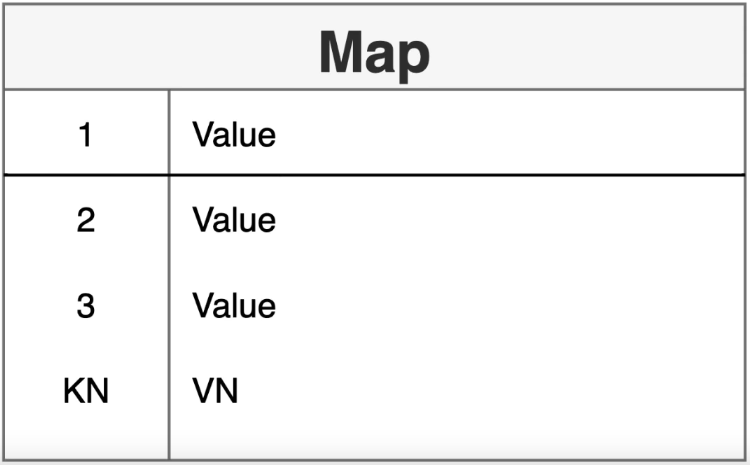
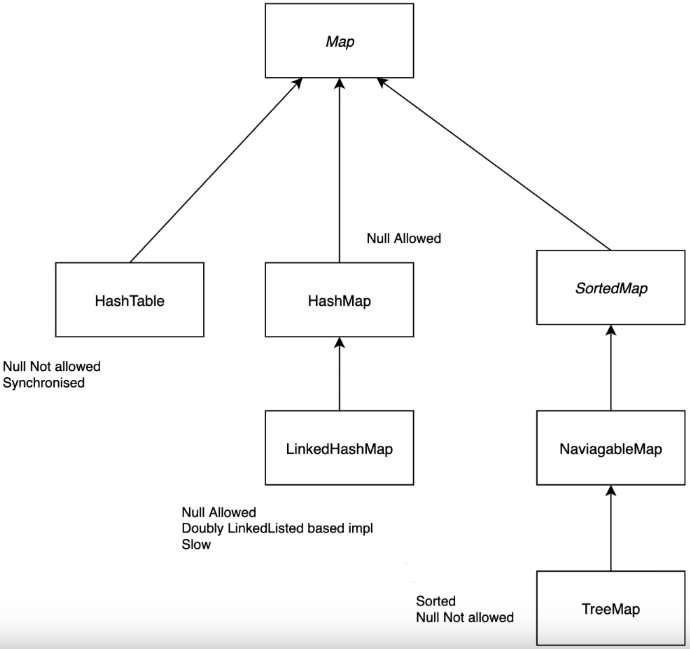
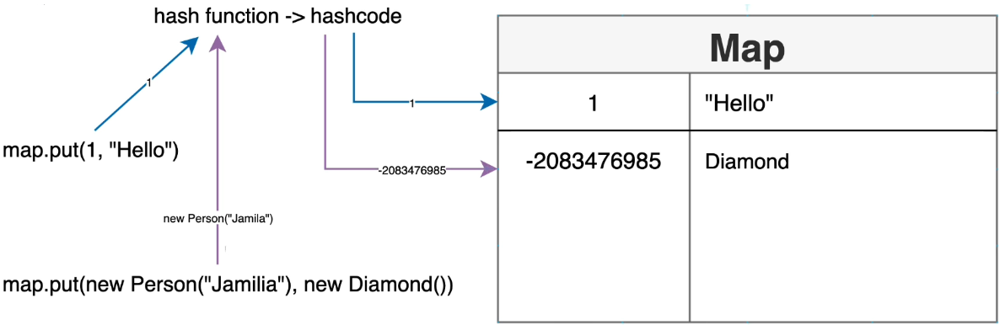

# Maps
------------
-  A collection of key value pairs
-  A map connot contain duplicate keys
-  Each key can map to at most one value



Map implementations that Java offers



-------------
#### General-purpose map implentations:
-  HashMap
    -  If you want maximum speed and don't care about iteration order
-  TreeMap
    -  If you need SortedMap operations or key-ordered Collection-view iteration
-  LinkedHashMap 
    -  If you want near-HashMap perormance and insertion-order iteration
#### Special-Purpose Map Implementations:
-  EnumMap
        -  high-performance Map implementation for use with enum keys (internally implemented as an array)
-  WeakHashMap
        -  implementation that stores only weak references to its keys (allows a key-value pair to be garbage-collected when its key is no longer referenced outside of the WeakHashMap)
-  IdentityHashMap
        -  Identity-based Map implementation based on a hash table (useful for topology-preserving object graph trasnformations, such as serialization or deep-copying
#### Concurrent Map Implentations:
-  ConcurrentMap
   -  A highly concurrent, high-performance implmentation backed up by a hash table (intended as a drop-in replacement for Hastable; also supports all the legacy methods peculiar to Hashtable)


-------------
#### Code Examples

Creating a map & Adding elements:

```
Map<Integer, Person> map = new HashMap<>();

//if there is a key duplicate it will overwrite the first
map.put(1, new Person("Alex"));
map.put(2, new Person("Alexa"));
map.put(3, new Person("Alexander"));
```

Prints outs:

```
System.out.println(map);
//returns:
//{1=Person[name=Alex], 2=Person[name=Alexa], 3=Person[name=Alexander]}

System.out.println(map.size());
//returns:
//3

System.out.println(map.get(1));

//returns:
//Person[name=Alex]

System.out.println(map.containsKey(4));
//returns:
//false

System.out.println(map.entrySet());
//returns:
//1, 2, 3

System.out.println(map.keySet());
//returns:
//{1=Person[name=Alex], 2=Person[name=Alexa], 3=Person[name=Alexander]}

System.out.println(map.values());
//returns:
//[Person[name=Alex', Person[name=Alexa], Person[name=Alexander]]
```

Loop through:

```
//loop through map
map.entrySet().forEach(System.out::println);
//returns:
//1=Person[name=Alex]
//2=Person[name=Alexa]
//3=Person[name=Alexander]

//loop through, return key and value
map.entrySet().forEach(x -> System.out.println(x.getKey() + " " + x.getValue()));
//returns:
//1 Person[name=Alex]
//2 Person[name=Alexa]
//3 Person[name=Alexander]

//another for each loop
map.forEach((key, person) -> {
    System.out.println(key + " - " + person);
});
```

Remove a key / getOrDefault

```
//to remove a key
map.remove(3);

System.out.println(map.get(3));
//returns null

System.out.println(map.getOrDefault(3, new Person("default")));

System.out.println(map.values());
//returns:
//[Person[name=Alex', Person[name=Alexa], Person[name=default]]
```

Hashfunctions & Hashcode


