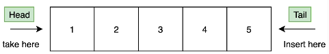
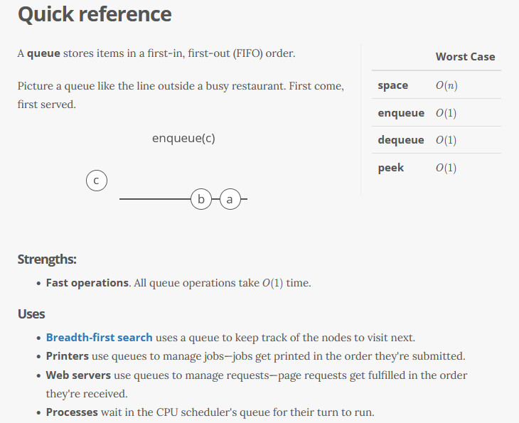

# Queue

- FIFO (First In, First Out)
- A collection designed for holding element prior to processing





--------------------------
add()

offer()

size()

peek()

poll()

remove()


```
Queue<Person> supermarket = new LinkedList<>();

  supermarket.add(new Person("Alex", 21));
  supermarket.add(new Person("Kevin", 31));
  supermarket.add(new Person("William", 25));

  //returns size of queue (3)
  System.out.println(supermarket.size());

  //returns element at the front (Person[name=Alex, age=21]
  System.out.println(supermarket.peek());

  //removes element at the front (also returns that element)
  //returns null if empty
  System.out.println(supermarket.poll());
```

alternative to **add()** is **offer()**
-  insets element into queue if it is possible to do immediately without violating capacity restrictions
-  this method is preferable to add() in cases when using a capacity-restricted queue
    -  add() can fail to insert an element only by thrrowing an exception 


alternative to **poll()** is **remove()**
-  both retrieve and removes the head of the queue
-  remove() differs in that it throws an exception if the queue is empty
