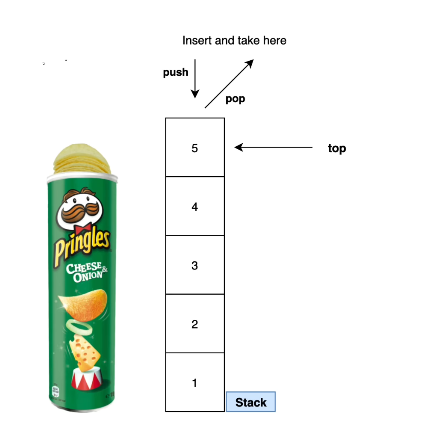

# Stack
-  The Stack class represents a last-in-first-out (LIFO) stack of objects.



---------------------

-  It extends class Vector with 5 operations that allow a vector to be treated as a stack. 
    -  The usual **push()** and **pop()** operations are provided, 
    -  as well as a method to **peek()** at the top item on a the stack
    -  a method to test for whether the stack is empty **empty()**
    -  and a method to **search()** the stack for an item and discover how far it is from the top

-  Vectors and, therefore, Stacks are synchoronized
        -  if a thread-safe implementation is not needed, it is recommeneded to use ArrayList in place of Vector 
-  Synchronized - when you're working in a multi-threaded environment and any access to your stack has to be synchronized
        -  slows down operations when working with a stack

 ------------------------
 
```
Stack<Integer> stack = new Stack<>();

//adds element to the stack (remember LIFO)
stack.push(1);
stack.push(2);
stack.push(3);

//returns the element at the top of the stack (3)
System.out.println(stack.peek());

//returns 3 (the size)
System.out.println(stack.size());

//returns whats at the top of the stack but also removes it
System.out.println(stack.pop());

//returns false (since its not empty)
System.out.println(stack.empty());
```

How to check if a stack contains a certain element (returns true or false)
```
//returns true
System.out.println(stack.contains(1));
```

How to check how far a certain element is from the top (if doesn't exist - returns a -1)
```
//returns 2 (element 1 is 2 spots away from the top)
System.out.println(stack.search(1));

//returns -1 (element doesn't exist)
System.out.println(stack.search(4));
```
