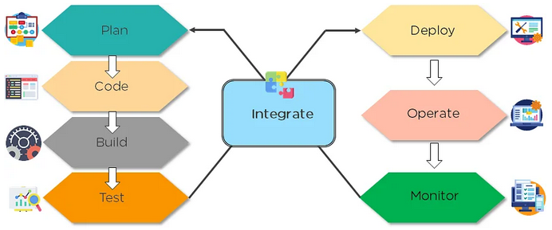

### What is DevOps?

 - The bridge between Development and Operations
 - With the purpose of automating a project to ensure smooth code releases
 - Aimed at increased productivity and quality of product development

### What is a DevOps Engineer

-  someone who has an understanding of SDLC (Software Development Lifecycle) and of automation tools for developing CI/CD pipelines.

## DevOps Tools

-  Version Control System tools. Eg.: git.
-  Continuous Integration tools. Eg.: Jenkins\
-  Continuous Testing tools. Eg.: Selenium
-  Configuration Management and Deployment tools. Eg.:Puppet, Chef, Ansible
-  Continuous Monitoring tool. Eg.: Nagios
-  Containerization tools. Eg.: Docker

## DevOps Lifecycle

-  Plan 
  -  Initially, there should be a plan for the type of application that needs to be developed. Getting a rough picture of the development process is always a good idea.
-  Code 
  -  The application is coded as per the end-user requirements. 
-  Build
  -  Build the application by integrating various codes formed in the previous steps.
-  Test
  -  This is the most crucial step of the application development. Test the application and rebuild, if necessary.
-  Integrate
  -  Multiple codes from different programmers are integrated into one.
-  Deploy
  -  Code is deployed into a cloud environment for further usage. It is ensured that any new changes do not affect the functioning of a high traffic website.
-  Operate
  -  Operations are performed on the code if required.
-  Monitor
  -  Application performance is monitored. Changes are made to meet the end-user requirements.

-----------------------------------------

## Configuration Management

#### What is the role of configuration management in DevOps?

-  Enables management of and changes to multiple systems.
-  Standardizes resource configurations, which in turn, manage IT infrastructure.
-  It helps with the administration and management of multiple servers and maintains the integrity of the entire infrastructure.

#### The Importance:
-  Automates time-consuming and tedious tasks
-  Also helps bring consistency and improvements in the product development process
  -  by means of design streamlining, extensive documentation, control, and change implementation during various phases/release of a project

#### What is it?
-  the process by which all environments hosting software are configured and maintained
-  Enables management of and changes to multiple systems

-  Configuration Management
  -  Configuration Identification
    -  Define the product and its configuration documentation id
  -  Change Management
    -  Control changes to a product and its configuration documentation
  -  Configuration Status Accounting
    -  Provide status and information about a product and its configuration documentation
  
  -  Configuration Audits

---------------------

## CI/CD
-  Continuous Integration / Continous Deployment

#### Continuous Integration (CI)
-  Integrating/Merging code into a shared repository, which is then validated by automated tests
  - Unit tests
  - Integration tests 

##### Advantages:
-  Improvement in software quality
-  Allows Dev teams to detect and fix errors at initial stages
-  Less time in delivering features

#### Continuous Delivery (CD)
-  the tested code from continuous integration is automatically deployed in various environments by a manual trigger.

-----------------------

## Infrastructure as Code
-  Infrastructure as Code (IaC) is the managing and provisioning of infrastructure through code instead of through manual processes.

---------------------

#### Packer
-  Packer is an open source tool for creating identical machine images for multiple platforms from a single source configuration

#### SSH
-  SSH stands for Secure Shell
  -  an administrative protocol that lets users have access and control the remote servers over the internet to work using the command line
  -  SSH also has a mechanism for remote user authentication, input communication between the client and the host, and sending the output back to the client.

#### Provisioning Defined
-  used when creating environments/resources and storage, an example phrase goes like this: "we need to provision a staging environment"

---------------------------------------

Important DevOps KPIs (Key Performance Indicators)

-  Meantime to failure recovery
  -  This is the average time taken to recover from a failure.
-  Deployment frequency
  -  The frequency in which the deployment occurs. 
-  Percentage of failed deployments
  -  The number of times the deployment fails.

---------------------------------------

## Software Development Life Cycle (SDLC)

1. Planning
2. Analysis
3. Design
4. Implementation
5. Testing & Integration
6. Maintenance

