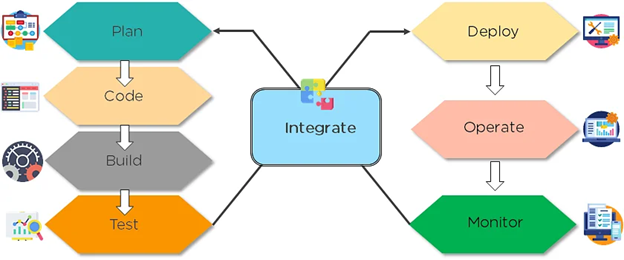

### What is DevOps?

 - The bridge between Development and Operations
 - With the purpose of automating a project to ensure smooth code releases
 - Aimed at increased productivity and quality of product development (CI/CD)
   - Through automation (creating environments, testing, delivering code, and deploying it the production environment)
   - Monitoring & feedback

#### Benefits of DevOps
-  Technical Benefits
  - Continuous software delivery
  - Less complex problems to manage
  - Early detection and faster correction of defects

-  Business Benefits
  -  Faster delivery of features
  -  Stable operating environments
  -  Improved communication and collaboration between the teams

### What is a DevOps Engineer

-  someone who has an understanding of SDLC (Software Development Lifecycle) and of automation tools for developing CI/CD pipelines.

## DevOps Tools

https://www.atlassian.com/devops/devops-tools

-  Version Control System tools. Eg.: git
-  Infrastucture as Code. Eg.: Terraform
-  Continuous Integration tools. Eg.: Jenkins
-  Continuous Testing tools. Eg.: Selenium
-  Configuration Management and Deployment tools. Eg.:Puppet, Chef, Ansible
-  Continuous Monitoring tool. Eg.: Nagios
-  Containerization tools. Eg.: Docker
-  Container Orchestration tools. Eg.: Kubernetes, AWS ECS(Elastic Container Service)

---------------------------------

## DevOps Lifecycle
-  Plan 
   -  Initially, there should be a plan for the type of application that needs to be developed. Getting a rough picture of the development process is always a good idea.
-  Code 
   -  The application is coded as per the end-user requirements. 
-  Build
   -  Build the application by integrating various codes formed in the previous steps.
-  Test
   -  This is the most crucial step of the application development. Test the application and rebuild, if necessary.
-  Integrate
   -  Multiple codes from different programmers are integrated into one.
-  Deploy
   -  Code is deployed into a cloud environment for further usage. It is ensured that any new changes do not affect the functioning of a high traffic website.
-  Operate
   -  Operations are performed on the code if required.
-  Monitor
   -  Application performance is monitored. Changes are made to meet the end-user requirements.

-----------------------------------------

## Infrastructure as Code (IaC)
-  IaC is the managing and provisioning of infrastructure through code instead of through manual processes
-  approach to design, provide, develop and maintain their cloud infrastructure

#### Why does IaC matter for DevOps?
-  IaC is an important part of implementing DevOps practices and continuous integration/continuous delivery (CI/CD)
  -  IaC takes away the majority of provisioning work from developers, who can execute a script to have their infrastructure ready to go

#### Benefits of IaC:
-  Cost reduction
-  Increase in speed of deployments
-  Reduce errors
-  Improve infrastructure
-  consistency
-  Eliminate configuration drift
-  IaC tool examples

#### As it relates to Configuration Management
-  Writing code to manage configuration, deployment, and automatic provisioning
-  Managing data centers with machine-readable definition files, rather than physical hardware configuration
-  Ensuring all your servers and other infrastructure components are provisioned consistently and effortlessly
-  Administering cloud computing environments, also known as infrastructure as a service (IaaS)
-----------------------------------------

## Configuration Management

#### What is the role of configuration management in DevOps?

-  Enables management of and changes to multiple systems.
-  Standardizes resource configurations, which in turn, manage IT infrastructure.
-  It helps with the administration and management of multiple servers and maintains the integrity of the entire infrastructure.

#### The Importance:
-  Automates time-consuming and tedious tasks
-  Also helps bring consistency and improvements in the product development process
  -  by means of design streamlining, extensive documentation, control, and change implementation during various phases/release of a project

#### What is it?
-  the process by which all environments hosting software are configured and maintained
-  Enables management of and changes to multiple systems

-  Configuration Management
  -  Configuration Identification
    -  Define the product and its configuration documentation id
  -  Change Management
    -  Control changes to a product and its configuration documentation
  -  Configuration Status Accounting
    -  Provide status and information about a product and its configuration documentation
  
  -  Configuration Audits

---------------------

## CI/CD
-  Continuous Integration / Continous Delivery / Continuous Deployment

**Jenkins** is one of the most popular DevOps tools used to create CI/CD pipelines
-  Build, test, deploy

#### CI/CD lifecycle
-  Plan
-  Build
  -  Using tools like docker & kubernetes to provision dev environments
    -  "it worked on my machine" no longer a problem, now it works on everyone's machines
-  Continuous integration and deployment
  -  Practice of checking in code to a shared repo and testing it
    -  Detecting problems early, fix them, and allows quick rollout of new features
-  Monitor
  -  Server monitoring and application performance monitoring
-  Operate
  -  Monitoring & problem tracking
-  Continuous feedback

#### Typical CI/CD pipeline
-  Build
  -  the stage where the application is compiled
-  Test
  -  stage where code is tested (automation saves both time & effort here)
-  Release
  -  stage where application is delivered to a repository
-  Deploy
  -  stage where code is deployed to production
-  Validation and Compliance
  -  ensuring the quality of images w/ security scanning tools

#### Continuous Integration (CI)
-  Integrating/Merging code into a shared repository, which is then validated by automated tests
  - Unit tests
  - Integration tests 

##### Advantages:
-  Improvement in software quality
-  Allows Dev teams to detect and fix errors at initial stages
-  Less time in delivering features

#### Continuous Delivery (CD)
-  the tested code from continuous integration is automatically deployed in various environments by a manual trigger.

#### Continuous Deployment
-  continuous deployment automates releasing an app to production

---------------------

#### Packer
-  Packer is an open source tool for creating identical machine images for multiple platforms from a single source configuration

#### SSH
-  SSH stands for Secure Shell
  -  an administrative protocol that lets users have access and control the remote servers over the internet to work using the command line
  -  SSH also has a mechanism for remote user authentication, input communication between the client and the host, and sending the output back to the client.

#### Provisioning Defined
-  used when creating environments/resources and storage, an example phrase goes like this: "we need to provision a staging environment"

#### Linux
-  Linux many times is used as a base for all the CI/CD tools to run on and interact with

#### Cloud
-  Cloud allows the integration of CI/CD with containers

#### AWS
-  Role of AWS in DevOps
  -  Flexible services
  -  Built for scale
  -  Automation
  -  Security
  -  Large partner ecosystem

-  ECS ( Elastic Container Service)
  -  a container orchestration platform, and a managed service that operates it and provisions hardware resources
  -  Advantages of ECS:
    -  Serverless infrastructure (allows you to operate containers without having to directly manage virtual machines)
    -  Built-in security
    -  AWS integration
    -  Spot instances

#### Bash Scripting / Python
-  Used to create scripts to automate processes (i.e., automate rebuilding an image)

#### Terraform
-  IaC Tool
-  File extension (.tf)
-  Provision resources in the cloud
-  Build, Change, & Version infrastructure safely & efficiently with code (HCL - HashiCorp Language)

#### Production Readiness Review (PRR)
-  Verifies that production design, planning, and other preparations for producing the system have progress to a point where a commitment can be made without risk

#### Crash Loop
-  Common error in Kubernetes, indicating a pod constantly crashing in an endless loop
-  Common causes:
  -  Insufficient resources,
  -  locked database,
  -  setup error,
  -  misconfigurations,
  -  etc.

---------------------------------------

#### Important DevOps KPIs (Key Performance Indicators)

-  Meantime to failure recovery
  -  This is the average time taken to recover from a failure.
-  Deployment frequency
  -  The frequency in which the deployment occurs. 
-  Percentage of failed deployments
  -  The number of times the deployment fails.

---------------------------------------

## Software Development Life Cycle (SDLC)

1. Planning
2. Analysis
3. Design
4. Implementation
5. Testing & Integration
6. Maintenance

