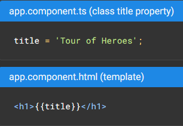

## Overview

Components - the fundamental building blocks of Angular applications
-  Class - written in TypeScript (.ts)
-  Template - written in HTML (.html)
-  Styling - written in CSS (.css)


Creating a new Angular workspace (CLI)
```
ng new angular-workspace1
```

Serving the application
```
cd angular-workspace1
ng serve --open
```

-  'ng serve' command builds the app, starts the development server, watches source files, and rebuilds the application as you make changes
-  '--open' flag opens a browser to http://localhost:4200/


