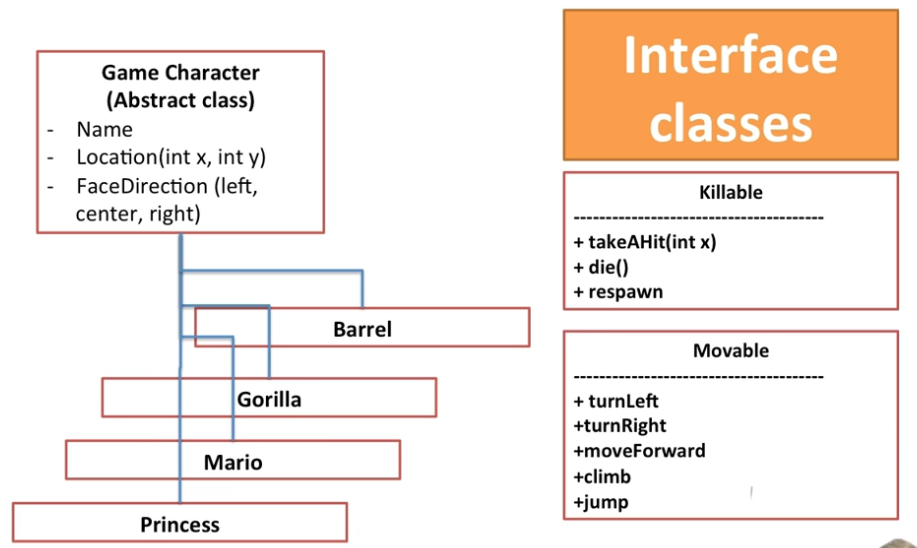
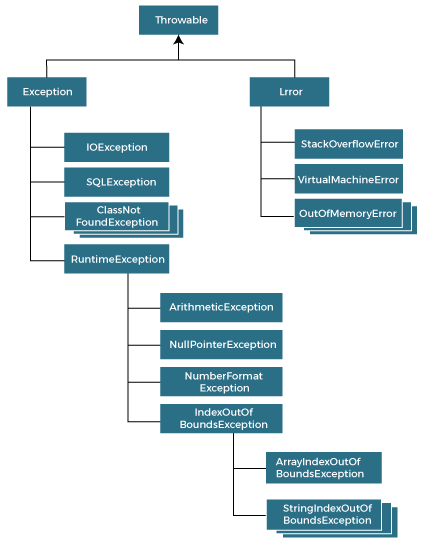
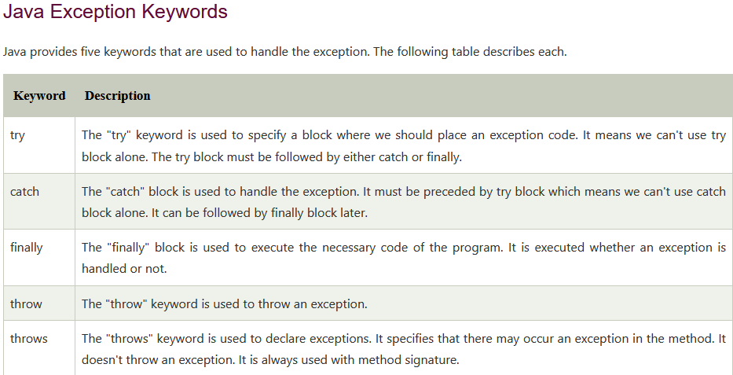

# Variables

Declaring a variable
```
int a;
```

Initializing a variable
```
int a = 10;
```

### Local Variables:
-  declared in methods, constructors, or blocks
    -  destroyed once it exits the method, constructor, or block
    -  only visible within / scope limited to the declared method, constructor, or block
-  there is no default values for local variables, so they should declared and initialized before first use
-  access modifiers cannot be used for local variables
```
public class Test {

//age is a local variable, only existing within the scope of the method
   public void pupAge() {
      int age;
      age = age + 7;
      System.out.println("Puppy age is : " + age);
   }

   public static void main(String args[]) {
      Test test = new Test();
      test.pupAge();
   }
}
```

### Instance Variables:
-  declared in a class, but outside a method, constructor, or any block
-  instance variables are created when an objected is created with the use of keyword 'new' and destroyed when object is destroyed
    -  ie. variables of person class: age, name, etc.
-  can be declared in class level before or after use
-  access modifiers can be g iven for instance variables
-  instance variables visible for all methods, constructor and block in the class
    -  recommende to make these variables private (access level)
        -  visibility for subclasses can be given for these variables with the use of access modifiers
-  instance variables have default values
    -  values can be assigned during declarion or within constructor
-  can be accessed directly by calling the variable name inside the class
    -  however, within stat methods (when instance variables are given accessibility), they should be called using the fully qualified name
        -  ObjectReference.VariableName
```
public class Employee {

   // this instance variable is visible for any child class.
   public String name;

   // salary  variable is visible in Employee class only.
   private double salary;

   // The name variable is assigned in the constructor.
   public Employee (String empName) {
      name = empName;
   }

   // The salary variable is assigned a value.
   public void setSalary(double empSal) {
      salary = empSal;
   }

   // This method prints the employee details.
   public void printEmp() {
      System.out.println("name  : " + name );
      System.out.println("salary :" + salary);
   }

   public static void main(String args[]) {
      Employee empOne = new Employee("Ransika");
      empOne.setSalary(1000);
      empOne.printEmp();
   }
}
```

### Class/Static Variables
-  declared with keyword 'static' in a class, but outside a method, constructor or a block
-  there would be only one copy of each class variable per class
-  rarely used other than being declared as *constants*
    - Constants are variables that are declared as public/private, final, and static
        -  constants variables never change from their intial value
-  created when the program starts and destroyed when the program stops
-  visibility is similar to instance variables
    - most static variables are declared public since they must be available for users of the class
- default values are same as instance variables
    - values can be assigned during the declaration or within the constructor
    - additionally, values can be assigned in special static initializer blocks
- can be accessed by calling with the class name
    - ie. ClassName.VariableName
- when declaring class variables as public static final, variable names must be in all upper case
    - if the static variables aren't public and final, naming syntax is the same as instance and local variables 
```
public class Employee {

   // salary  variable is a private static variable
   private static double salary;

   // DEPARTMENT is a constant
   public static final String DEPARTMENT = "Development ";

   public static void main(String args[]) {
      salary = 1000;
      System.out.println(DEPARTMENT + "average salary:" + salary);
   }
}
```

(tutorialspoint.com/java/java_variable_types.htm)

--------------------------------

# Access Modifiers
-  Access Modifiders
    -  default, public, protected, private
-  Non-access Modifiers
    -  final, abstract, strictfp

##### Public 
-  Everyone can see it

##### Private 
-  only class in which it is declared can see it

##### Package Private 
-  Can only be seen and used by the package in which it is declared (this is the default in Java)

##### Protected 
-   Package Private + can be seen by subclasses or package members

--------------------------------
# Enumerations

Use Enums where there's a fixed range of values that a variable can be
-  A static variable won't inforce that it must be one of those values, whereas an Enum would
-  can be declared as their own or inside a class

```
class FreshJuice {
   enum FreshJuiceSize{ SMALL, MEDIUM, LARGE }
   FreshJuiceSize size;
}

public class FreshJuiceTest {

   public static void main(String args[]) {
      FreshJuice juice = new FreshJuice();
      juice.size = FreshJuice.FreshJuiceSize.MEDIUM ;
      System.out.println("Size: " + juice.size);
   }
}
```

-----------------------------
# Looping
- Types of Loops
    -  while loop
    -  for loop
    -  do...while loop
    -  enhanced for loop
        - for(declaration : expression)
-  Loop control statements
    -  break statement (used to terminate the loop immediately)
    -  continue statement (used to skip the current iteration of the loop)

-----------------------------
# Decision Making Statements
- if statement
- if...else statement
- nested if statement
- switch statement

-----------------------------
# Methods

```
public static int methodName(int a, int b) {
   // method body
}
```
public static / modifier

-  defines the access type of the method and it is optional to use

int / return type
-  method may return a value
-  void keyword allows creation of methods that do not return a value

methodName / name of the method

int a, int b / parameters

method body
-  defines what the method does with the statements

## Static vs Non-Static
-  A **static method** belongs to a class
-  A **Non-static** (AKA instance) method belongs to each object that is generated from that class

https://www.youtube.com/watch?v=ZXQFGiGtoo4

Example:

```
class Foo {
    int i;

    public Foo(int i) { 
       this.i = i;
    }

    public static String method1() {
       return "An example string that doesn't depend on i (an instance variable)";
    }

    public int method2() {
       return this.i + 1; // Depends on i
    }
}
```
You can call static methods like this: Foo.method1(). If you try that with method2, it will fail. But this will work: Foo bar = new Foo(1); bar.method2();


##### When to use

If your method does something that doesn't depend on the individual characteristics of its class, make it static (it will make the program's footprint smaller). Otherwise, it should be non-static.

-----------------------------

# Abstract Class vs Interface

##### Abstract Class
-  Used for Common Properties
-  Cannot be instantiated, can but be subclassed
    -  A subclass can get all the properties/methods that its parent class has 
    -  instantiated class is when you make an instance of that parent class in memory

##### Interface
-  Used for Common Methods



-----------------------------------

#### Final keyword in Java
-  Final Variable
    -  To create a variable that can't be modified (essentialy a constant)
-  Final Methods
    -  Prevent method overriding
-  Final Classes
    -  Prevent inheritance

-------------------------------------

# Java Memory

-  In Java, you don't need to explicitly allocate and deallocate memory. The JVM and more specifically the Garbage Collector handles memory allocation
    -  Garbage collection is the process of looking at heap memory and identifying which objects are in use and which aren't, then deleting the unused objects

## Stack and Heap
-  Both generic terms for ways in which memory can be allocated
-  Both stored in RAM

-  Stack memory size is very less compared to Heap memory
-  Because of simplicity in memory allocation (LIFO), Stack memory is very fast when compared to Heap memory

## Stack
-  **Stack** is a part of memory that contains information about nested method calls down to the current position in the program
    -  Contains all local variables and references to objects on the heap defined in currently executing methods
    -  Stack memory is short lived
    -  Every thread has its own stack
    -  When Stack memory is full, Java runtime throws - "java.lang.StackOverFlowError"

## Heap
-  **Heap** is a large bulk of memory intended for allocation of objects
    -  When you create an object wit the *new* keyword, it gets allocated on the heap
        -  (however, the refernece to the object lives on the stack)
    -  Heap memory lives from the start till the end of application execution
    -  When Heap memory is full, it throws - "java.lang.OutOfMemoryError: Java Heap Space" error

---------------------------------------

# Exception Handling

-  Exception handling is a mechanism to handle runtime errors

#### Advantages of Exception Handling:

-  The core advantage is **to maintain the normal flow of the application**.

#### Some Reasons behind the Occurence of Exception
-  Whenever a user provides invalid data.
-  The file requested to be accessed does not exist in the system
-  When the Java Virtual Machine (JVM) runs out of memory
-  Network drops in the middle of communication

#### Hierarchy of Java Exception Classes



#### Types of Java Exceptions

1.  Checked Exception
    -  The classes that directly inherit the Throwable class exception RunetimeException and Error
        -  IOException, SQLException, etc. 
    -  Are checked at compile-time
2.  Unchecked Exception
    -  The classes that inherit the RunetimeException
        -  ArithmeticException, NullPointerException, ArrayIndexOutOfBoundsException, etc.
            -  Are checked at runtime
3.  Error
    -  Error is irrecoverable
        -  OutOfMemoryError, VirtualMachineError, AssertionError etc.





#### Java Exception Handling Example

```
public class JavaExceptionExample{  
  public static void main(String args[]){  
   try{  
      //code that may raise exception  
      int data=100/0;  
   }catch(ArithmeticException e){System.out.println(e);}  
   //rest code of the program   
   System.out.println("rest of the code...");  
  }  
}  
```

----------------------------

## Sorting Custom Object by implementating Comparable Interface in Java

```
// Java program to sort student
// data according to their names
  
import java.util.*;
  
// implementing comparable interface
class StudentData implements Comparable<StudentData> {
  
    int roll;
    String name;
    int marks;
  
    // Constructor
    StudentData(int roll, String name, int marks)
    {
        this.roll = roll;
        this.name = name;
        this.marks = marks;
    }
  
    // overriding method to sort
    // the student data
    public int compareTo(StudentData sd)
    {
  
        // compareTo is a string method
        return this.name.compareTo(sd.name);
    }
}
  
// Driver class
class GFG {
    public static void main(String[] args)
    {
  
        ArrayList<StudentData> list
            = new ArrayList<StudentData>();
  
        // Inserting data
        list.add(new StudentData(1, "Ram", 98));
        list.add(new StudentData(2, "Shyam", 84));
        list.add(new StudentData(3, "Lokesh", 90));
  
        Collections.sort(list);
  
        // Displaying data
        for (StudentData sd : list)
            System.out.println(sd.roll + " " + sd.name + " "
                               + sd.marks);
    }
}
```

-----------------------------------------

## Copy - Two Types of Copies (Reference & Object)

## Reference Copy

A reference copy creates a copy of a reference variable pointing to an object
-  So we'll have two reference variables, referencing the same object

## Object Copy

An object copy creates a copy of the object itself

-  So we'll have two reference variables, that each reference different objects

Ways to copy an object
-  Using a copy constructor
-  Using a **clone() method**
        -  Object cloning refers to the creation of an exact copy of an object. It creates a new instance of the class of the current object and initializes all its fields with exactly the contents of the corresponding fields of this object.

### Types of object copies

### Shallow
-  Changes made to inner objects will reflect in both main objects (original & copy) due to referencing same inner-objects/variables
-  Shallow copies are cheap (on memory) and easy to make


To create a **shallow** copy, only copy the main object and have your new shallow copy reference the same inner objects of the original

-  e.g., Main object, Person, consisting of inner objects like name and age - copy the Person object, consisting of references to the inner objects of the original

### Deep
-  A deep copy is a fully indepdent copy of an object
        -  because of this, both main objects (original & copy) can be changed independently without reflecting any changes on the other


To create a **deep** copy, copy the entirety of the main object along with its inner-objects/variables

-  e.g., Main object, Person, consisting of inner objects like name and age - copy the Person object, as well as the inner objects
