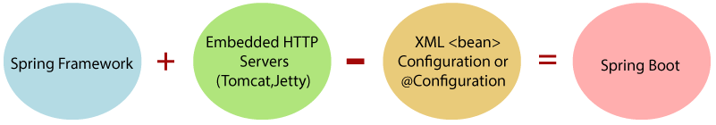

## Goals of Spring Boot
-  The main goal of Spring Boot is to reduce development, unit test, and integration test time. 

### What is Spring Boot

-  Spring Boot is a project that is built on the top of the Spring Framework. It provides an easier and faster way to set up, configure, and run both simple and web-based applications.

-  It is a Spring module that provides the RAD (Rapid Application Development) feature to the Spring Framework. It is used to create a stand-alone Spring-based application that you can just run because it needs minimal Spring configuration.

-  In short, Spring Boot is the combination of Spring Framework and Embedded Servers.

-----------------------------------

### We should use Spring Boot Framework because:

-  The dependency injection approach is used in Spring Boot.
-  It contains powerful database transaction management capabilities.
-  It simplifies integration with other Java frameworks like JPA/Hibernate ORM, Struts, etc.
-  It reduces the cost and development time of the application.

### Advantages of Spring Boot

-  It creates stand-alone Spring applications that can be started using Java -jar.
-  It tests web applications easily with the help of different Embedded HTTP servers such as Tomcat, Jetty, etc. We don't need to deploy WAR files.
-  It provides opinionated 'starter' POMs to simplify our Maven configuration.
-  It provides production-ready features such as metrics, health checks, and externalized configuration.
-  There is no requirement for XML configuration.
-  It offers a CLI tool for developing and testing the Spring Boot application.
-  It offers the number of plug-ins.
-  It also minimizes writing multiple boilerplate codes (the code that has to be included in many places with little or no alteration), XML configuration, and annotations.
-  It increases productivity and reduces development time.

#### Spring Boot Features

-  Web Development
-  SpringApplication
-  Application events and listeners
-  Admin features
-  Externalized Configuration
-  Properties Files
-  YAML Support
-  Type-safe Configuration
-  Logging
-  Security

@Component
-  @Controller
    -  Presentation layer
-  @Service
    -  Service layer
-  @Repository
    -  Data Access layer
