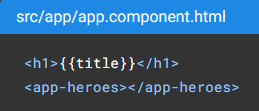
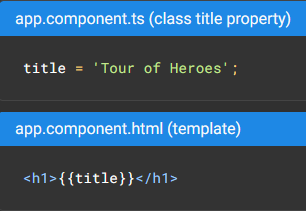

## Overview

The page you see is the application shell
-  the shell is controlled by an Angular component named AppComponent

Components - the fundamental building blocks of Angular applications
-  Class file - written in TypeScript (.ts)
-  Template file - written in HTML (.html)
-  Styling file - written in CSS (.css)

-------------------------------------

## Class File (.ts)

```typescript
import { Component, OnInit } from '@angular/core';

@Component({
  selector: 'app-heroes',
  templateUrl: './heroes.component.html',
  styleUrls: ['./heroes.component.css']
})
export class HeroesComponent implements OnInit {

  constructor() { }

  ngOnInit(): void {
  }

}
```

@Component is a decorator that specifies the Angular metadata for the component

CLI genereated three metadata properties:

1) selector - component's CSS element selector

2) templateURL - location of the component's template (.html) file

3) styleUrls - location of component's private CSS styles


ngOnInit() is a lifecycle hook (a component instance has a lifecycle that starts when Angular instantiates the component class)
-  Angular calls ngOnInit() shortly after creating a component
-  good place to put initialization logic

-------------------------------------

## Angular Application Creation

Creating a new Angular workspace (CLI)
```cl
ng new angular-workspace1
```

Serving the application
```cl
cd angular-workspace1
ng serve --open
```
-  'ng serve' command builds the app, starts the development server, watches source files, and rebuilds the application as you make changes
-  '--open' flag opens a browser to http://localhost:4200/

Generating a new component

 ```cl
 ng generate component newComponent
 ```
 creates a new folder, src/app/newComponent, and generates the three component files along with a test file

--------------------------------------

## How to show a component in the view

To display a component, you must add it to the template of the shell (AppComponent)

Use the component's element selector (app-heroes) in the AppComponent template file



---------------------------------------

## Binding

Angular's interpolation binding syntax, presents the component's title property value inside the HTML header tag


Two-way binding
-  [(ngModel)]
    -  Creates a FormControl instance from a domain model and binds it to a form control element

----------------------------------------

Pipes
-  good way to format string, currency amounts, dates and other display data
-  Angular has several built-in pipes and you can create your own
    -  angular.io/guide/pipes
```
<h2>{{hero.name | uppercase}} Details</h2>
```
