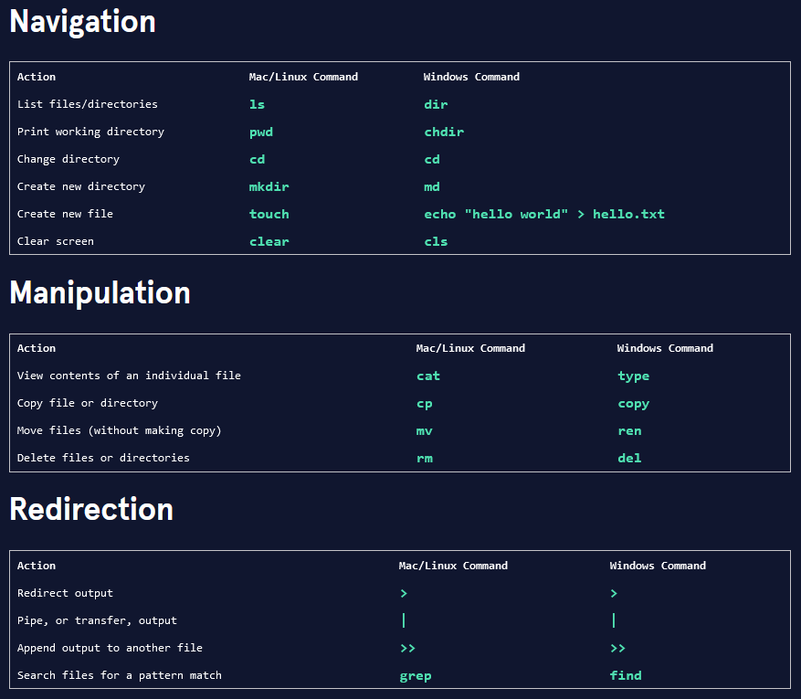

# Shell Commands

--------------------
# Quick Ref

https://www.git-tower.com/blog/command-line-cheat-sheet/

--------------------

## Navigation Commands

*options* : modify the behavior of commands
**--** : long name version

**-** : short name version

**ls** : list files
-  **-a** : includes hidden files and directories
-  **-l** : lists in long format, as well as the file permissions
    -  **-al** : includes hidden files and directories
-  **-t** : orders files and directories by the time they were last modified
    - **alt** : includes hidden files 

**pwd** : print working directory / outputs the name of the directory you're currently in

**cd** : change directory
-  cd .. : move up one directory
-  cd ../.. : move up two directories

**mkdir** : make directory

**touch** : creates a new file inside a working directory ($ touch keyboard.txt)

**echo "Hello Command Line" >> hello_cli.txt** : create a file named hello_cli.txt and add *Hello Command Line* to that file

**cat** : view contents of individual file in terminal
-  cat hello_cli.txt : print the contents of the hello_cli.txt file to the terminal

------------------

## Copying, moving, and removing files and directories from the command line

**cp** : copies files or directories
-  *Copy contents of source file -> destination file*:
    -  cp source.txt destination.txt
- *Copy a file -> destination directory*: 
    -  cp source.txt destination/ 
- *Copy multiple files -> directory*:
    -  cp file1.txt file2.txt my_directory/

**mv** : moves a file without making a copy
-  *Move a file -> directory*:
    -  mv my_file.txt my_directory/
-  *Move multiple files -> directory*:
    -  mv my_file_1.txt my_file_2.txt my_directory/
-  *Rename a file*:
    -  mv file_origin.txt file_renamed.txt

**rm** : delete files and directories
-  *Remove a file*:
    -  rm unwanted_file.txt
-  *Remove a directory (and all of its child directories)*:
    -  rm -r unwanted_directory

------------------

## Input/Output Redirection

Through *redirection* you can direct input and the output of a command to and from other files and programs, and chain commands together in a pipeline

**echo** : accepts a standard input, and echoes back to the terminal a standard output

>  *standard input* (stdin), **information inputted into the terminal** through keyboard or input device
>  
>  *standard output* (stdout), **information outputted** after a process is run
>  
>  *standard error* (stderr), **error message outputted** by a failed process
>  

>  **redirection** *reroutes* stdin, stdout, and stderr *to* or *from a different location*

~ ~ ~ ~ ~ ~ ~ ~ ~ ~ ~ ~ ~ ~ ~ ~ ~ ~ ~

**>** : redirects a standard output to a file / overwrites
-  Redirecting a string into a file
    -  echo "Hello" > hello.txt
    -  cat hello.txt
-  Redirect standard output of *cat deserts.txt* -> forests.txt (overwrite a file's contents)
    -  cat deserts.txt > forests.txt

~ ~ ~ ~ ~ ~ ~ ~ 

**>>** : takes the standard output of the command on the left and appends it to the file on the right
-  output data of *forests.txt* being **appended** to *deserts.txt*:
    -  cat forests.txt >> deserts.txt

~ ~ ~ ~ ~ ~ ~ ~ 

**<** : takes the standard input from file on right and inputs it into the program on the left (redirects input into a command)
-  cat < lakes.txt

~ ~ ~ ~ ~ ~ ~ ~ 

**|** : pipe, takes the standard output of the command on the left, and pipes it as a standard input to the command on the right

>  "**Command to command**" redirection

Multiple **|**s can be chained together, to pipe one output into another command, and so on and so forth

-  *Pipe* cat volcanoes.txt into wordcount command, *pipe* wordcount results into cat _ volcanoes_count.txt
        -  cat volcanoes.txt | wc | cat > volcanoes_count.txt
     
~ ~ ~ ~ ~ ~ ~ ~ 

**sort** : takes the standard input and orders it alphabetically for the standard output (doesn't change the file itself)
-  *Sort* output of lakes.txt
    -  sort lakes.txt
-  Input *sorted* output of lakes.txt int file called sorted-lakes.txt
    -  cat lakes.txt | sort > sorted-lakes.txt

~ ~ ~ ~ ~ ~ ~ ~ 

**uniq** : stands for unique - filters out adjacent, duplicate lines in a file
-  *Filter unique* values only
    -  uniq deserts.txt
-  *Sort* and *Filter* into file
    -  sort deserts.txt | uniq > uniq-deserts.txt

**grep** : searches files lines that match a pattern and then returns the results (case sensitive)
-  *grep -i* enables the command to be case insensitive
-  Search for "Mount/mount" (case insensitive) in file and return those results
    -  grep -i mount mountains.txt
-  *grep -R* searches all files in a directory and **outputs filenames and lines** containing matched results (-R stands for recursive)
-  *grep -Rl* searches all files in a directory and **outputs only the filename(s)** with matched results (so no lines)
        -  grep -Rl 

~ ~ ~ ~ ~ ~ ~ ~ 

**sed** : stands for stream editor - accepts standard input and modifies it based on an expression, similar to "find and replace"
-  *sed* searches forests.txt for the word, "snow", and replaces it with "rain" (*only replaces the first instance*)
    -  sed 's/snow/rain/' forests.txt
>  's/snow/rain/'
>   
>   **s**: stands for "substitution" - *always* used when using **sed** for substitution
>   
>   **snow**: the search string (or text to find)
>   
>   **rain**: the replacement string (or text to add in place)

-  To replace all instances, use the expression *g*, meaning global
    -  sed 's/snow/rain/g' forests.txt
-  To rewrite a file, meaning actually replacing and saving use *-i*
    -  sed -i 's/snow/rain/g' forests.txt

------------------

## Wildcards

Special characters like * to select groups of files
-  *Copy all files* in the current working directory into another directory
    -  cp * my_directory/
-  *Copy all files starting with "w" and ending with ".txt"* in the current working directory and copies them to my_directory/
    -  cp w*.txt my_directory/

------------------

## Helper Commands

**clear** : clear your terminal

*tab* : autocomplete your command

*up/down arrows* : cycle through previous commands

------------------

# Configuring the Command Line Environment
 
----------

## Nano / Command line text editor

Type *nano* in the command line to open up Nano
-  type '*nano* hello.txt' to open up a text file in nano

>  ctrl + O : to save a file
>  
>  ctrl + X : to exit nano
>  
>  ctrl + G : open help menu

----------

## Bash Profile
>  A bash profile is a file used to store environment settings for your terminal

-  Making changes in the bash profile available right away without having to restart a new terminal session: use **source**
*source* ~/.bash_profile

------------

## Aliases

>  The **alias** command allows you to create keyboard shortcuts, or *aliases* for commonly used commands

1.  Open ~/.bash_profile in nano
2.  alias aliasName="commandName"
-  alias ll="ls -la"
-  alias hy="history"
3.  source ~/.bash_profile

------------

## Environment Variables

**Environment Variables** are variables that can be used across commands and programs, and hold information about the information
-  i.e., **export USER="Jane Doe"**
    -  *USER="Jane Doe"* sets the environment variable, USER, to "Jane Doe"
    -  *export* makes the variable be available to all child sessions initiated from the session you are in
    -  (At the command line) the command, *echo $USER* returns the value of the variable
        -  *$* is always used when returning a variable's value

**PS1 Environment Variables** define the makeup and style of the command prompt
-  i.e., **export PS1=">> "**
    -  Instead of '$', you'll have '>> '
        -  >> echo "hello"

**HOME Environment Variable** displays the path of the home directory
-  i.e., **echo $HOME** returns /c/Users/will

**PATH Environment Variable** stores a list of directories serparated by a colon
-  The **PATH** variable simply lists which directories contain scripts
    -  i.e., scripts stored in the /bin directory such as: /bin/pwd, /bin/ls, etc.

**env** command stands for "environment" - returns a list of the environment variables for the current user
-  i.e., **env** command returns a number of variables (PATH, PWD, PS1, and HOME)
    -  **env**
-  i.e., To select the value of a particular environment variable
    -  **env | grep PATH** (or you can replace PATH with PWD, PS1, HOME, etc.)

------------------------

## Linux Key Shortcuts

CTRL + C --> Stops current command

CTRL + Z --> Sleep program

CTRL + A --> Goes to start of line

CTRL + E --> Goes to end of line

CTRL + U --> Cuts from start of line

CTRL + K --> Cuts to end of line

CTRL + Y --> Pastes Text

CTRL + R --> Searches history

CTRL + P --> Previous command in history

CTRL + N --> Next command in history

CTRL + L --> Clears the screen

!! --> Repeats the last command

!abc --> Runs last command starting with 'abc'

!ls:p --> Prints last command starting with 'abc'
