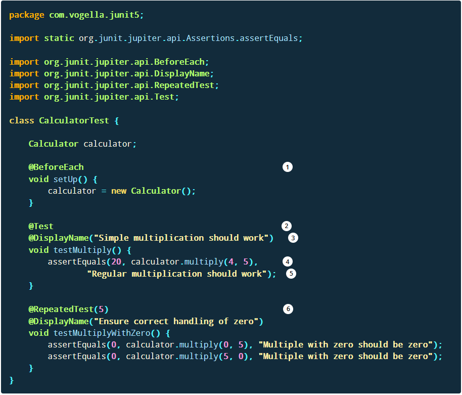

## Testing

-  Testing is the process of executing a program with the aim of finding errors. To make our software perform well it should be error-free. If testing is done successfully it will remove all the errors from the software. 

## Software Testing Life Cycle

1) Requirement Analysis
    -  First understand what the software/feature is supposed to do
2) Test Planning & 3) Test Case Development
    -   scope of testing(part of software under testing and objectives for testing), creating documentation, deciding tools and platforms, who will be testing, etc.
4) Test Environment Setup
    -  perpare environment with test data that mimics the end user's environment
5) Test Execution
    -  tester runs the software or feature under test vertifies the output with the expected outcome
6) Test Closure 
    -  Two possible outcomes, both indicate the end of the test cycle
        -  tester finds a bug, in which case they create a test record/bug report
        -  the software works as expected

---------------------------

### Types of Testing
-  Unit Testing
-  Integration Testing
-  Regression Tetsing
-  System Testing
-  Smoke Testing
-  Performance Testing
-  Stress Testing
-  User-Acceptance Testing

https://www.vogella.com/tutorials/JUnit/article.html#unittesting_junitexample
### Unit Testing
-  Unit Tests will test small units of work in your code
    -  This would normally be testing a single public method in a public class
       -  Any external classes your method used should be mocked within the test

Where should the test be located?

-  src/main/java - for Java classes
-  src/test/java - for test classes

---------------------------

### Example for developing a JUnit 5 test for another class

```java
package com.vogella.junit5;

public class Calculator {

    public int multiply(int a, int b) {
        return a * b;
    }
}
```




1) The method annotated with @BeforeEach runs before each test
2) A method annotated with @Test defines a test method
3) @DisplayName can be used to define the name of the test which is displayed to the user
4) This is an assert statement which validates that expected and actual value is the same, if not the message at the end of the method is shown
5) @RepeatedTest defines that this test method will be executed multiple times, in this example 5 times

-----------------------------------

### Integration Testing
-  Integration Tests should test aspects of your application in a full vertical flow, e.g. call an API and test that it goes through your code and writes to the database
-  Ensures that multiple components of systems work as expected when they are combined to produce a result.

### Regression Testing
-  Ensures that existing features/functionality that used to work are not broken due to new code changes

### System Testing
-  Complete end-to-end testing is done on the complete software to make sure the whole system works as expected

### Smoke Testing
-  A quick test performed to ensure that the software works at the most basic level and doesn’t crash when it’s started

### Performance Testing
-  Ensures that the software performs according to the user’s expectations by checking the response time and throughput under specific load and environment

### Stress Testing
-  Ensures that the performance of the software doesn’t degrade when the load increases. In stress testing, the tester subjects the software under heavy loads, such as a high number of requests or stringent memory conditions to verify if it works well

### User-Acceptance Testing
-  Ensures the software meets the requirements of the clients or users. This is typically the last step before the software is live, i.e. it goes to production
