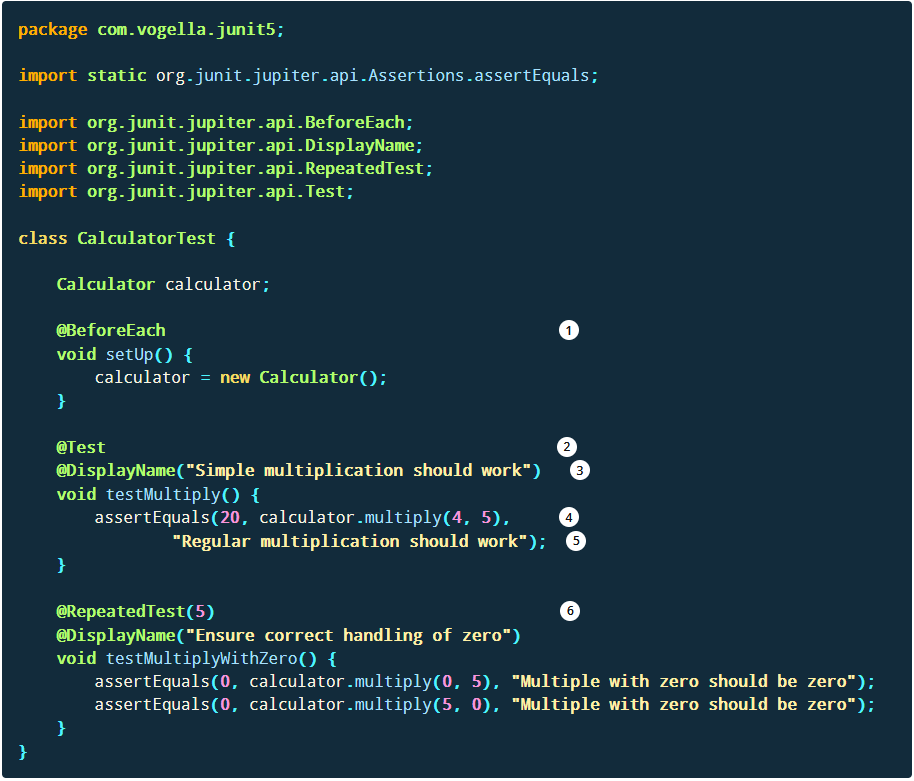

## Testing

-  Testing is the process of executing a program with the aim of finding errors. To make our software perform well it should be error-free. If testing is done successfully it will remove all the errors from the software. 

---------------------------

### Types of Testing

https://www.vogella.com/tutorials/JUnit/article.html#unittesting_junitexample
### Unit Testing
-  Unit Tests will test small units of work in your code
    -  This would normally be testing a single public method in a public class
       -  Any external classes your method used should be mocked within the test

Where should the test be located?

-  src/main/java - for Java classes
-  src/test/java - for test classes

---------------------------

### Example for developing a JUnit 5 test for another class

```
package com.vogella.junit5;

public class Calculator {

    public int multiply(int a, int b) {
        return a * b;
    }
}
```




1) The method annotated with @BeforeEach runs before each test
2) A method annotated with @Test defines a test method
3) @DisplayName can be used to define the name of the test which is displayed to the user
4) This is an assert statement which validates that expected and actual value is the same, if not the message at the end of the method is shown
5) @RepeatedTest defines that this test method will be executed multiple times, in this example 5 times

-----------------------------------

